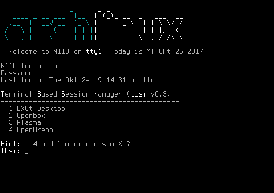
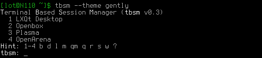
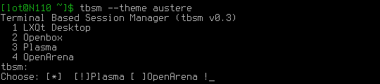
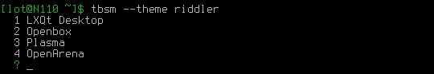

_tbsm_ is an application or session launcher, written in pure bash with no
ncurses or dialog dependencies. It is inspired by _cdm_, _tdm_, in some way by
_krunner_ and related.

It was attempted to design the behavior of _tbsm_ to be as less pesky as
possible, and to start daily tasks with as less key strokes.

Furthermore is there the possibility to customize his look by themes.

### Last version is 0.5, released Dez 2018

#### Release Notes

    857fca4 - Add support for Wayland sessions
              Thanks to Ian for this very welcome patch

Older release notes [are here](https://raw.githubusercontent.com/loh-tar/tbsm/master/doc/80_ChangeLog.txt).

The full changelog [is there](https://github.com/loh-tar/tbsm/commits/master).

### Screenshots

These shots are here to give you an idea what you will get. Don't worry, even if
the pictures are a bit antique, they are still up to date, except for the version
number you can read there.

#### tbsm with tulizu

That's how my login screen looks after a while with an issue file of
[tulizu](https://loh-tar.github.io/tulizu/) and the default _tbsm_ theme.

#### gently theme after a while giving a hint

#### austere theme after _return_ with quick menue

#### riddler theme

### Install

#### Packages

Arch users find it in [AUR](https://aur.archlinux.org/packages/tbsm/)

#### From Source

In most cases simply _cd_ into the downloaded source tree and run:

    sudo make install

However, should you be on a non GNU system, or using a somehow special
distribution which only has a BusyBox, please [see here.](https://github.com/loh-tar/tbsm/issues/9)

To remove, which you will of cause never do, run:

    sudo make uninstall

### Post Install Tasks

Read the [manual](https://github.com/loh-tar/tbsm/blob/master/doc/01_Manual.txt),
section 3- and 4- how to autostart and configure tbsm, by running:

    tbsm doc man

### License

GNU General Public License (GPL), Version 2.0
